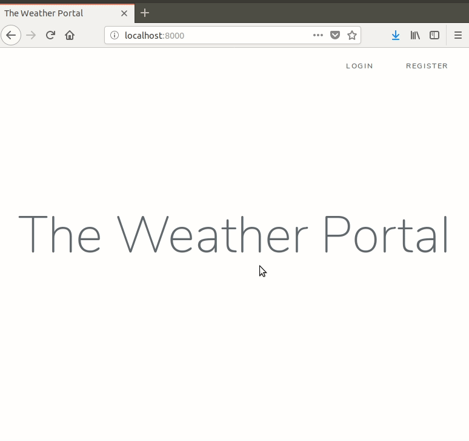

Weather Portal
==============

Single Page Application using Laravel and Vue.js, with user registration and forecast of 5 days weather.

Installation instructions
-------------------------

Configure your `.env` file, setting up your database and the weather services settings:

- `WEATHER_API` as *openweathermap* or *yahooweather*
- `OPENWEATHERMAP_API_KEY` with your API Key, if you are using Open Weather Map. 

Run the following commands:

- `php artisan migrate`
- `composer install`
- `php artisan serve`

Have fun!

TODO
----

Include functional and unit tests.
